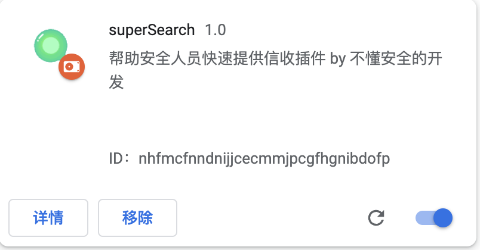
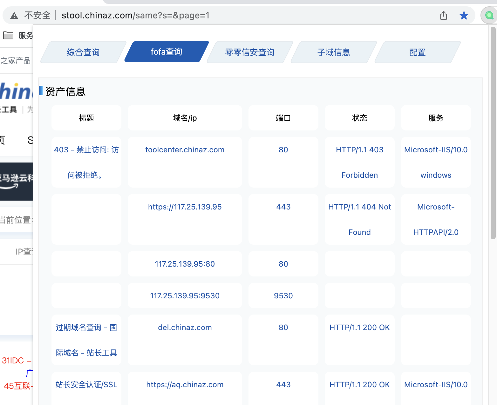
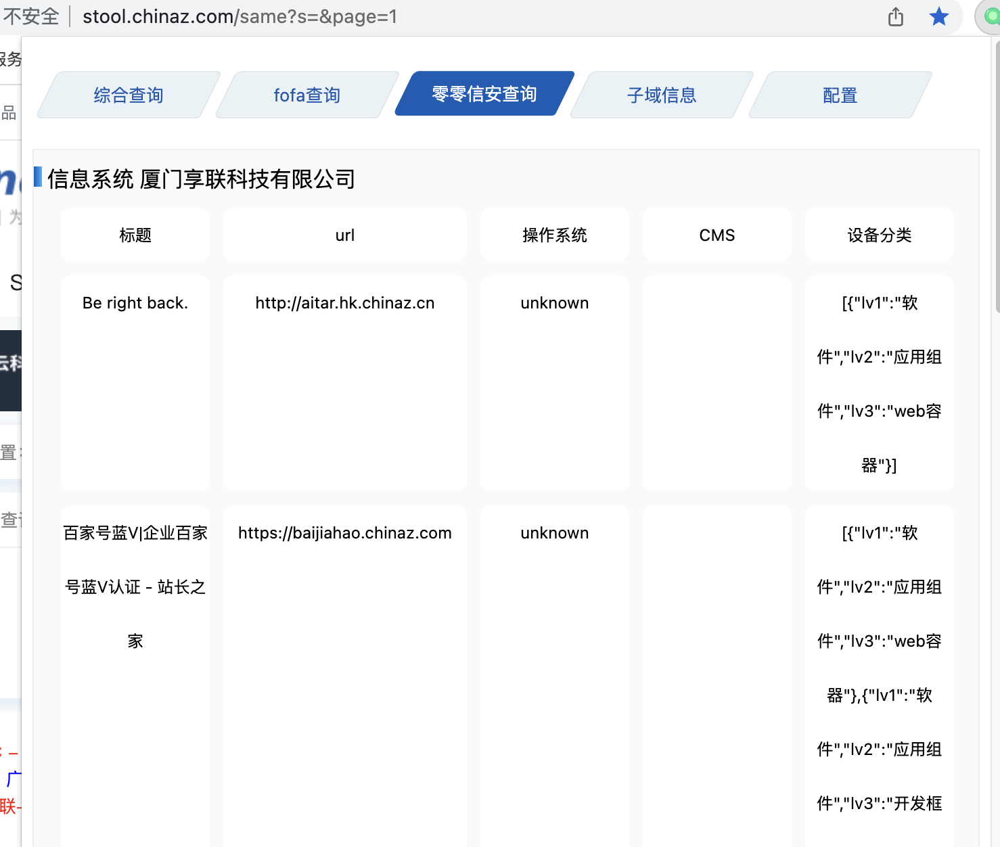
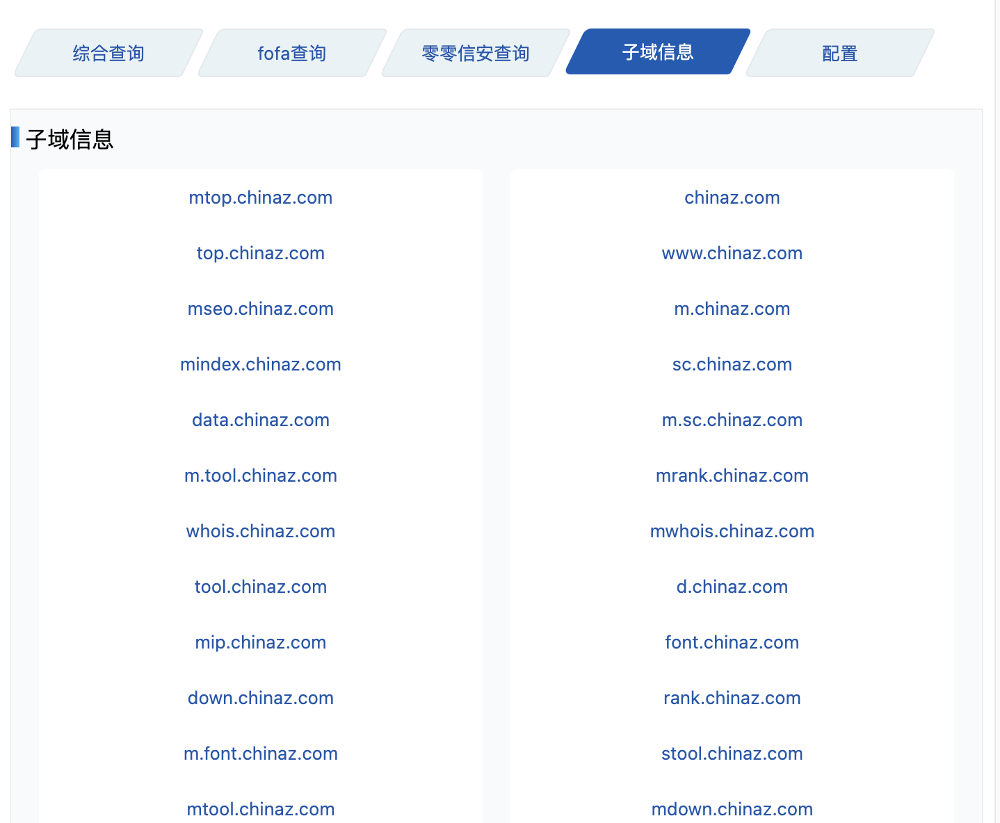
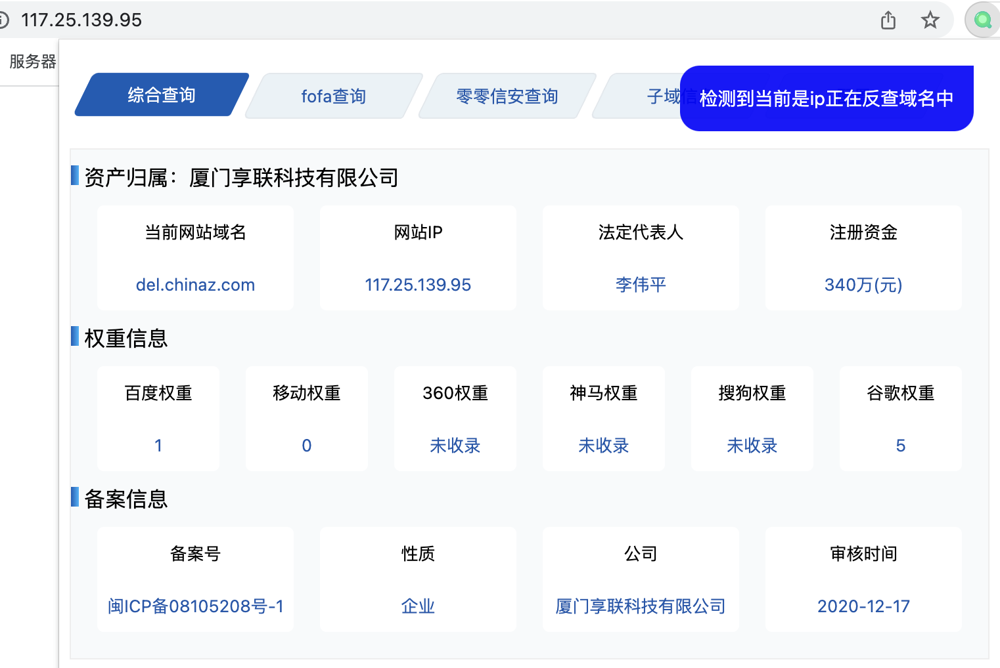

# superSearh 1.0(该版本仓库已经不在维护 正在开发新版 全新ui)
## 移步 https://github.com/dark-kingA/superSearchPlus
帮助安全人员快速提供信息收集插件（插件响应速度取决于你当前的网速）by 不懂安全的开发
开科学上网的插件的响应速度慢！！！！！

# 初衷
本人菜鸡一枚 挖360的亿万守护计划 需要权重相关信息 经常去各个网站查询 有点麻烦 所以就写了这个小工具

# 插件详情
辅助安全人员快速查找所需信息

## 提取当前tab的url

## fofa查询（根据当前ip条件项）

## 零零信安查询（根据当前公司条件项）如公司不存在 提取当前ip作为条件项

## 子域信息

## 配置文件
零零信安 zoneKey需要申请 每天只能申请一次 key的时效是永久的
申请地址 https://0.zone/applyParticulars?type=site

## ip反查域名
考虑到实际情况下ip的站点也很多 所以添加了 反查域名 的功能

## 插件安装
git clone https://github.com/dark-kingA/superSearh.git
解压后打开chrome://extensions/ 
直接将解压后的文件拖进去即可使用
## 其他问题
部分师傅安装后可能出现插件异常 打不开插件页面 更新chrome浏览器
作者本地版本 版本 106.0.5249.91（正式版本） (arm64)
## 技术交流
欢迎各位师傅提意见及技术交流等
## 人员
感谢五六七安全团队团长m0be1的细节 板块 优化

