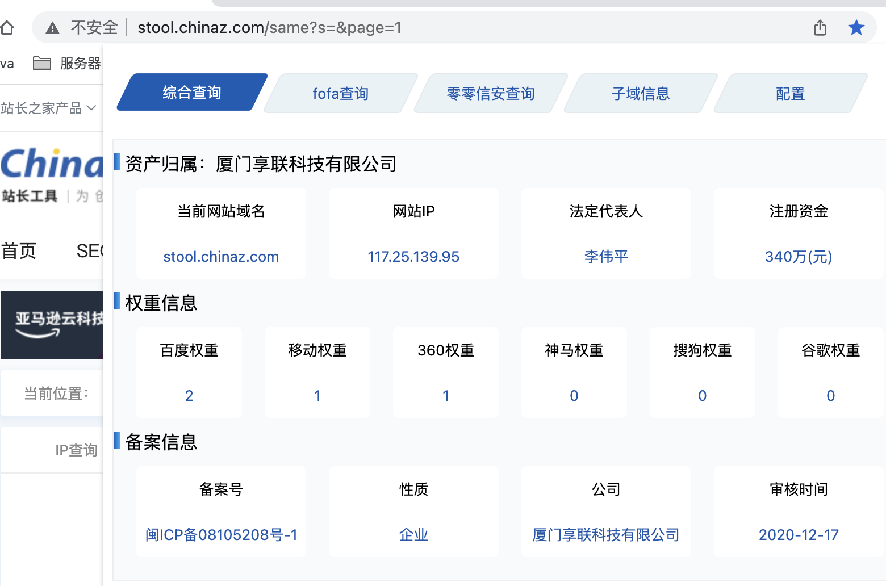

# superSearh 1.0
帮助安全人员快速提供信息收集插件（插件响应速度取决于你当前的网速）by 不懂安全的开发

# 初衷
本人菜鸡一枚 挖360的亿万守护计划 需要权重相关信息 经常去各个网站查询 有点麻烦 所以就写了这个小工具

# 插件详情
辅助安全人员快速查找所需信息

## 提取当前tab的url

## fofa查询（根据当前ip条件项）

## 零零信安查询（根据当前公司条件项）如公司不存在 提取当前ip作为条件项

## 子域信息

## 配置文件
零零信安 zoneKey需要申请 每天只能申请一次 key的时效是永久的

## ip反查域名
考虑到实际情况下ip的站点也很多 所以添加了 反查域名 的功能

# 技术交流
欢迎各位师傅提意见及技术交流等

